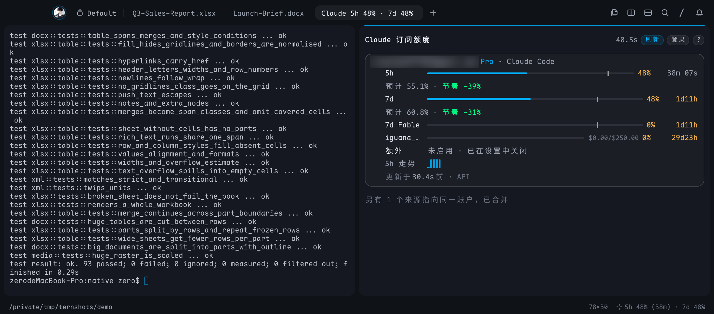

# Claude Usage（Tern 插件）

在 Tern 里实时查看 Claude Pro / Max 订阅额度：5 小时窗口、7 天窗口、分模型周额度（Opus / Sonnet / Fable …）、额外用量（usage credits）以及促销类额度，并支持直接在面板里 OAuth 登录订阅账户。



## 安装

```sh
tern plugin link /path/to/tern-plugins     # 开发时链接；或 tern plugin install <dir|git url>
```

需要在 Preferences › Plugins 里打开插件（`settings.json` 的 `"plugins": true`，且 `plugins_disabled` 不含 `claude-usage`）。

- 命令面板：**Claude 用量：显示 / 隐藏额度浮窗** / **Claude 用量：登录订阅账户**，或 **New Claude Usage block**（普通分屏块）。
- 状态栏（需打开 Tern 状态栏）：`5h 42% (2h13m) · 7d 18%`，颜色随用量变化，点击切换浮窗。

浮窗固定在当前标签页右上角（`cx.layout:float(..., "tr")`）。再次执行"显示 / 隐藏"关闭它；当前标签页已有平铺的额度块时改为把它浮起并聚焦，不重复打开。"登录订阅账户"会替换已有浮窗，以带登录参数重新打开。

## 面板

每个账户一张卡片：

| 内容 | 说明 |
| --- | --- |
| 窗口进度条 | 服务端返回的利用率；竖线标出窗口已过去的时间比例 |
| 节奏 | 与均匀使用相比超出/低于多少；按当前平均速度会在重置前用尽时给出预计用尽时间 |
| 重置 | 一天内为实时倒计时，之外为剩余时长；后面是本地时间 |
| 额外用量 | 本月已用 / 上限，或未启用及原因 |
| 走势 | 最近 48 次采样的 5h / 7d 迷你折线 |
| 更新于 | 数据年龄与来源（API / Claude Code 缓存 / 上次缓存） |

按键：`r` 立即刷新 · `l` 登录 · `j`/`k` 选择账户 · `x` 移除（仅插件登录的账户，回车确认）· `+`/`-` 刷新间隔（30s–10m）· `c` / `o` 开关 Claude Code / omp 来源 · `s` 开关状态栏 · `?` 说明 · `Esc` 取消登录。

布局随面板宽度变化：每个窗口一行（名称 · 进度条 · 重置倒计时），文字不换行，放不下时以 … 截断。窄于 60 列时隐藏来源、节奏细节和走势（只保留"预计用尽"警告）；90 列以上再显示重置的本地时间和 7d 走势。完整说明在悬停提示里，按键列表在 `?` 里。

## 账户来源

| 来源 | 位置 | 令牌刷新 |
| --- | --- | --- |
| 插件登录 | `<state>/plugin-data/claude-usage/accounts.json`（权限 600） | 过期前自动刷新，轮换后的 refresh token 写回同一文件 |
| Claude Code | macOS 钥匙串 `Claude Code-credentials`（设置了 `CLAUDE_CONFIG_DIR` 时带哈希后缀），否则 `~/.claude/.credentials.json` | 先重读存储（Claude Code 可能已自行刷新）；仍过期才刷新，并把新令牌对写回原处、保留其他字段，Claude Code 继续可用 |
| omp | `~/.omp/agent/agent.db`（`sqlite3 -readonly`） | 只读，不刷新（刷新会使 omp 的登录失效）；过期时提示在 omp 中重新登录 |

同一账户（account uuid + org uuid）出现在多个来源时只显示、只请求一次，优先级：插件登录 > Claude Code > omp。

## 登录

`l` 或「登录账户」：生成 PKCE（`od` 读 `/dev/urandom`），在系统浏览器打开 `https://claude.ai/oauth/authorize`。

- 本机 54545 端口空闲时，用 `nc -l 54545` 接住回调 `http://localhost:54545/callback`，授权后自动完成。
- 端口被占用时改用 `https://platform.claude.com/oauth/code/callback`，页面显示 `code#state`，粘贴到面板（⌘V）即可；回调 URL 也可直接粘贴。
- 令牌端点依次尝试 `platform.claude.com` 与 `api.anthropic.com`。

## 刷新策略

- 数据源：`GET https://api.anthropic.com/api/oauth/usage`（`anthropic-beta: oauth-2025-04-20`），账户信息来自 `/api/oauth/profile`（每次会话每账户一次）。
- 面板打开时按间隔轮询（默认 60s）；关闭后按后台间隔（300s）轮询供状态栏使用；状态栏关闭且面板未打开时不发请求。
- Claude Code 运行时会把它最新的用量写进 `~/.claude.json`，若比插件的数据新且属于同一账户，直接采用，不额外请求。
- 429 时遵循 `Retry-After`，否则从 1 分钟起指数退避（上限 15 分钟），期间保留上次数据；`r` 可强制刷新。401 时自动刷新令牌重试一次。

## 开发

```sh
brew install luau
python3 tests/run.py          # 纯模块 + 主机/窗口流程（假的 tern 运行时）
```

`tests/run.py` 把模块打包成单个 chunk 运行（独立 `luau` 会隔离每个模块的全局变量，无法注入假的 `tern`）。

| 文件 | 作用 |
| --- | --- |
| `host.luau` | 块 `claude-usage.usage`：按键、事件、登录 |
| `window.luau` | 状态栏段与命令面板命令 |
| `lib/poller.luau` | 共享轮询：来源合并、令牌刷新、退避、缓存、状态摘要（kv `status`） |
| `lib/usage.luau` | `/usage` 响应归一化与节奏计算 |
| `lib/oauth.luau` | OAuth 常量、PKCE、换码、刷新、API 请求 |
| `lib/creds.luau` | 三种凭据来源的读写 |
| `lib/login.luau` | 登录流程（回环监听 + 粘贴） |
| `lib/view.luau` | 面板视图 |
| `lib/crypto.luau` / `lib/time.luau` | SHA-256、base64url、URL 编码；ISO 时间与时长文本 |
